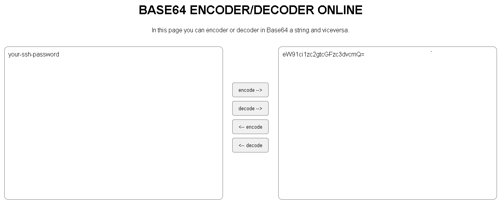

# SSH cluster (cmds, uploader)
This is simple, execute commands & upload files over multiple SSH/SFTP servers.


### Notes

- Python3 (Anaconda works)
- for Windows test need you install Visual Studio Build tools (paramiko package requeriment)


## How It Works?

- Edit creds.json
- Edit cmds.json
- Add your IP/hostname to srv.txt


## How do I edit creds.json?

You can use  to generate your base64 strings


Ex:

You want encode ```your-ssh-password``` to base64 string





You need replace ```line 6``` on creds.json

```json
{
  "creds" : {

    "ssh_user" : "ssh-user-base64-encoded",
    "ssh_password" : "ssh-password-base64-encoded",
    "sudo_password" : "eW91ci1zdWRvLXBhc3N3b3Jk"
  }
}
```

Repeat this steps for ```ssh_user``` and ```sudo_password``` ? 


## How do I edit cmds.json?


Do you need to run ```ls -la``` without sudo?

```json
{
  "cmds" :
  {
    "1" : {
      "cmd" : "ls -la"
    }
  }
}
```

Do you need to run ```mkdir /i_am_root``` with sudo?

```json
{
  "cmds" :
  {
    "1" : {
      "cmd" : "mkdir /i_am_root",
      "sudo" : true
    }
}
```

Do you need both?

```json
{
  "cmds" :
  {
    "1" : {
      "cmd" : "mkdir /i_am_root",
      "sudo" : true
    },

    "2" : {
      "cmd" : "ls -la"
    }
  }
}

```

Remember add sudo password in ```creds.json``` (base64 string format)


## Need to upload files?

Easy, drop files over `file_uploads`


## Need to change the path where your files will be uploaded?

By default, all files save over tmp, you can change this on ```ssh-cluster-upload.py```

```python
remote_folder = "/tmp/"
```


## Dependencies 

- paramiko